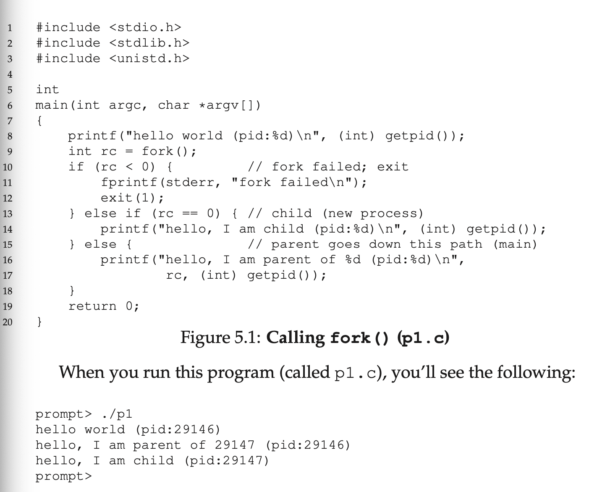
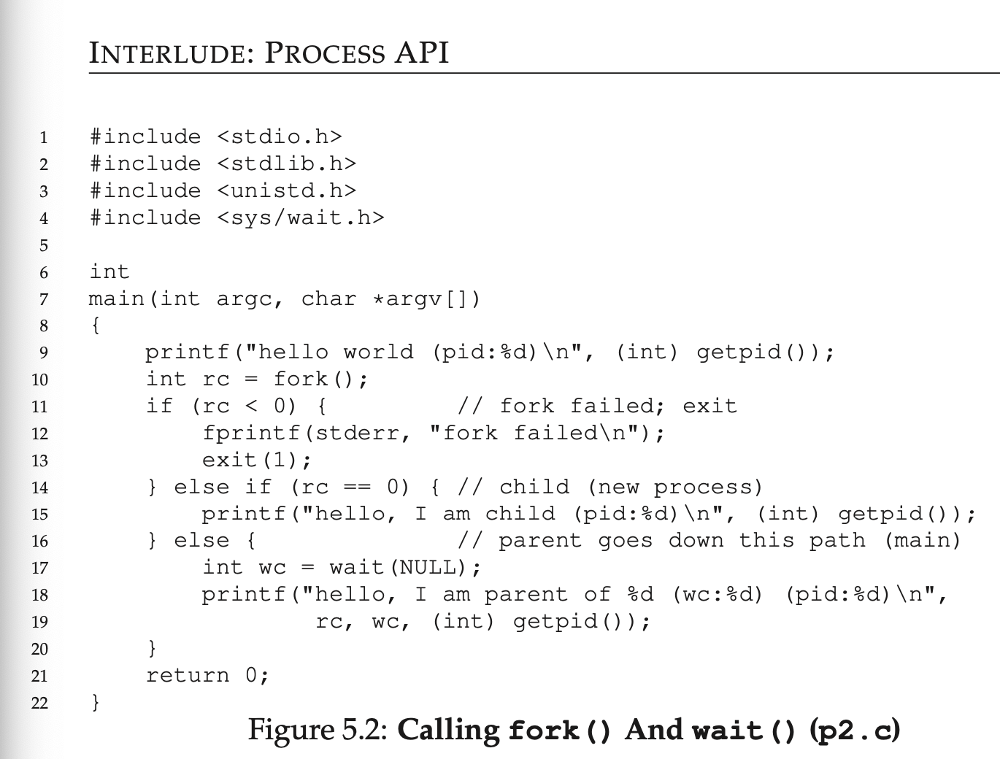
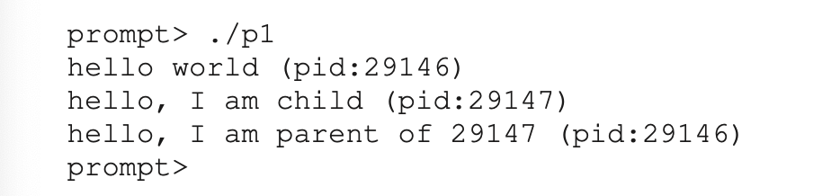

# Chapter 5: Interlude: Process API 

--

## Aside: Interludes

- Interludes will cover more practical aspects of systems, including a particular focus on OS APIs and how to use them

--

- We will discuss process creation in UNIX systems

- UNIX presents one of the most intriguing ways to create a new process with a pair of system calls: `fork()` and `exec()`

- A third routine, `wait()` can be used by a process wishing to wait for a process it has created to complete

- We not present these interfaces in more detail, with a new cimple examples to motivate us:

--

## CRUX: HOW TO CREATE AND CONTROL PROCESSES 

- What interfaces should the OS present for process creation and control?

- How should these interfaces be designed to eneable ease of use as well as utility?

--

## The `fork()` System Call

- The `fork()` system call is used to create a new process.

- Be forewarned: it is certainly the strangest routine to call

- More specifically, you have a running program whose code looks like what you see in Figure 5.1

- Examine the code, type it in and run it 

- When it first started running, the process prints out hellow world message 

- Included in that message is its **process identifier**, also known as **PID**

- The process has a PID of 29146; in UNIX systems, the PID is used to name the process if one wants to do something with the process, such as for example, stop it from running

- The process calls the `fork()` system call, which the OS provides as a way to create a new process

- The _odd part_: the process that is created is an (almost) _exact copy of the calling process_

- That means that to the OS, it now looks like there are two copies of the program `p1` running, and both are about to return from the `fork()` system call

- The newly-created process (called the **child**, in contrast to the creating **parent**) doesn't start running at `main()`

- Rather, the newly-created process just _comes to life_ as if it had called `fork()` itself

- The child isn't an _exact_ copy

- Specifically, although the child now has its own copy of the address space (i.e., its own private memory), its own registers, its own PC, and so forth...

- The value it returns to the caller of `fork()` is different

- While the parent receives the PID of the newly-created child, the child receives a return code of `0`

- This difference is useful because it is simple then to write the code that handles the two difference cases

- You might also have noticed: the output of `p1.c` is not **deterministic**

- When the child process is crated, there are now teo active processes in the system that we care about: the parent and the child

- Assuming we are running on a system with a single CPU, then either the child or the parent might run at that point 

- In the following example, the parent did and thus printed out it message first. However in other cases, the opposite might happen, such as the output trace shown below Figure 5-2

- The CPU **scheduler** determines which process runs at a given moment in time 

- Whichever process is chooses to run first remains a mystery due to its complexity

- This **non-determinism** leads to some interesting problems, particularly the **multi-threaded programs**

- Hence, we will see this again when dealing with **concurrency**

--

## 5.2 The `wait()` System Call

- Sometimes it is useful for a parent to wait for a child process to finish what it has been doing 

- This task is accoplished with the `wait()` system call (or its more complete sibling `waitpid()`) - See **Figure5.2**

- In this example (`p2.c`) the parent process calls `wait()` to delay its execution until the child finishes executing

- When the child is done, `wait()` returns to the parent

- Adding a `wait()` call to the code above makes the output deterministic

- If the parent runs first, it will immediately call `wait()`; this system call won't return until the child has run and exited

- Even when the parent runs first, it waits for the child to finish running, then `wait()` returns, and then the parent prints its message 

--

## 5.3 Finally, The `exec()` System Call

- A final and important piece of the process creation API is the `exec()` system call

- This system call is useful when you want to run a program that is different from the calling program

- For example, the calling `fork()` in `p2.c` is only useful if you want to keep running copies of the same program 

- However, often you want to run _different_ programs; `exec()` does just that in **Figure 5.3**

- In this example, the child process calls `execvp()` in order to run the program `wc`, which is the word counting program, which tells how many lines, words, and bytes are found in the file

- The `fork()` system call is strange, its partner in crime, `exec()` is not so normal either 

- What it does: given the name of an executable (e.g., `wc`), and some arguments (e.g., `p3.c`), it **loads** cone (and static data) from that executable and overwrites its current code segment (and current static data) with it 

- The heap and stack and other parts of the memory space of the program are re-initialized

- Then the OS simply runs that program, passing in any arguments as the `argv` of that process

- Thus, it does _not_ create a new process; rather, it transforms the currently running program (formerly `p3`) into a different running program (`wc`)

- After the `exec()` in the child, it is alsmot as if `p3.c` never ran; a successful call to `exec()` never returns

--

## 5.4 Why? Motivating The API

- Why would we build such an odd interface to what shoul dbe the simple act of creating a new process?

- The separation of `fork()` and `exec()` is essential in building a UNIX shell

- The separation lets the shell run code _after_ the call to `fork()` but _before_ the call to `exec()`

- This code can alter the environment of the about-to-be-run program

-Thus, enabling a variety of interesting features to be readily built

--

### Tip: GETTING IT RIGHT (LAMPSON'S LAW)

- As Lampson states in his well-regarded "Hints For Computer Systems Design" **Get it right**

- Neither abstraction nor simplicity is a substitute for getting it right

- Sometimes, you just have to do the right thin, and when you do, it is way better than the alternatives

- There are lots of ways to design APIs for process creation; however the combination of `fork()` and `exec()` are simple and immensely powerful

--

- The shell is just a user program [^4]

- The shell shows you a **prompt** and then waits for you to type something into it

- You then type a command (i.e., the name of an executable program, plus any arguments) into it

- In most cases, the shell then figures out where in the file system the executable resides

- The shell then calls `fork()` to careate a new child process to run the command

- The shell then calls some variant of `exec()` to run the command, then waits for the commant to complete by calling `wait()`

- When the child completes, the shell returns from `wait()` and prints out a prompt again, ready for your next command

- The separation of `fork()` and `exec()` allos the shell to do a while bunch of useful things rather easily.

- For example, `prompt> wc p3.c > newfile.txt`

- In the above example, the output of the program `wc` is **redirected** into the output file `newfile.txt` (the greate-than sign is how the redirection is indicated)

- The way the shell accomplishes this task is quote simple: when the child is created, before calling `exec()` the shell closes **standard output** and opens the file `newfiles.txt`

- By doing so, any output from the soon-to-be-running program `wc` are sent to the file instead of the screen

- **Figure 5.4** shows a program that does exactly this

- The reason this redirection works is due to an assumption about how the operating sysstem manages file descriptors

- UNIX systems start looking for free file descriptors at zero

- In this case, STDOUT_FILENO will be the first available one and thus gets assigned when `open()` is called 

- Subsequent writes by the child process to the standward output file descriptor, for example by routines such as `printf()`, will then be routed transparently to the newly-opened file instead of the screen.

[^4]: And there are lots of shells; tcsh, bash, and zsh to name a few. You should pick one, read its man pages, and learn more about it; all UNIX experts do.