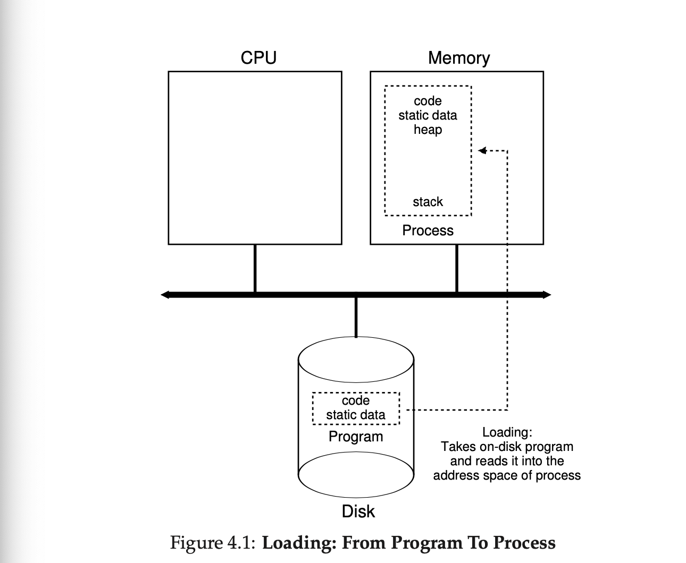

# Chapter 4: The Abstraction: The Process

- One of the most fundamental abstractions that the OS provides to users is the **process**

- A **process** is a **running program**

- The program itself is a lifeless thing, just instructions waiting to come to life.  The OS takes these bytes and get them running, transforming the program into something useful.

--

## How to provide the illusion of many cpus

- Although there are only a few physical CPUS available, how can the OS provide the illusion of nearly-endless supply of said CPUs?

--

- The OS creates this isllution by **virtualizing** the CPU

- By running one process, then stopping it and running another, the OS can promote the illusion that many virtual CPUs exist when in fact there is only one physical CPU (or a few).

- This basic technique is known as **time sharing** of the CPU, allowing users to run as many concurrent processes as they would like; the potential cost is performance, as each will run more slowly if the SPUs must be shared.

- To implement cirtualization of the CPU, and to implement it well, the OS  will need both some low-level machinery as well as some high-level intelligence 

- We call the low-level machinery **mechanisms**; mechanisms are low-level methods or protocols that implement a needed piece of functionality.

- e.g. we will learn later how to implement **context switch** which gives the OS the ability to stop running one program and start running another on a given CPU

- This **time-sharing** mechanism is employed by all modern OSes.

--

## TIP: USE TIME SHARING (AND SPACE SHARING)

- **Time-sharing** is a bsic technique used by an OS to share a resource.

- By allowing the resource to be used for a little while by one entity, and then a little while by many

- The counterpart of time sharing is **spae sharing**, where a resource is divided  (in space) among those who with to use it

- e.g. disk space is naturally a spaceshared resource, once a block is assigned to a file, it is normally not assigned to another file until the user deletes the original file.

--

- On top of these mechanisms resides some of the intelligence in the OS, in the form of **policies**

- Policies are algorithms for making some kind of decision within the OS

- E.G. given a number of possible rograms to run on a CPU, which program should the OS run?

- A **scheduling policy** in the OS will make this decision, likely using historical information (e.g., which program has run more over the last minute?), workload knowledge (e.g., what types of programs are run), and perfoormance metrics (e.g., is the system optimizing for interactive performance, or throughput?) to make its decision.

## 4.1 The Abstraction: A Process

- The abstraction provided by the OS of a running program is something we will call a **process**

- A process is simply a running program

- We can summarize a process by taking an inventory of the different pieces of the system it accesses or affects during the course of its execution

- To understand what constitutes a process, we thus have to understand its **machine state**: what a program can read or update when it is running.

- At any given time, what parts of the machine are important to the execution of this program?

- One obvious component of machine state that comprises a process is its _memory_

- Instructions lie in memory; the data that the running programs reads and writes sit in memory as well

- Thus, the memory that the process can address (called its **address space**) is part of the process.

- Also part of the process' machine state are _registers_; many instructions explicitly read or update registers and thus clearly they are important to the execution of the process

- Note that there some particularly special registers that form part of this machine state.

- e.g., the **program counter(PC)** sometimes called the **instruction pointer** or **IP** tells us which instruction of the program is currently being executed; similarly a **stack pointer** and associated **frame pointer** are used to manage the stack for function parameters, local variables, and return addresses.

- Finally, programs often access persistent storage devices too.

- Such I/O _information_ might include a list of the files the process currently has open.

## 4.2 Process API

- Though we defer discussion of a real process API until a subsequent chapter, we first give some idea of what must be included in any interface of an operating system.

- These APIs, in some form, are available on any modern operating system 

1. **Create**
   - An operating system must include some method to create new processes.

   - When you type a command into the shell, or double-click on an application icon, the OS is invooked to create a new process to run a program you have indicated

2. **Destroy**

   - As there is an interface for process creation, systems also provide an interface to destroy processes forcefully.

   - Many processes will run and just exit by themselves when complete

   - When they don't, however, the user mau wish to kill them, and thus an interface to halt a runwaway process is quite useful

3. **Wait**

   - Sometimes it is useful to wait for a process to stop running; thus some kind of waiting interface is often provided

4. **Miscellaneous Control**

   - Other than killing or waiting for a process, there are sometimes other controls that are possible 

   - e.g., most OS provide some kind of method to suspend a process (stop it from running for a while) and then resume it (continue it running)

5. **Status**

   - There are usually interfaces to get some status information about a process as well, such as how long it has run for, or what state it is in.

{#figure4-1}

## 4.3 Process Creation: A little More Detail

- One mystery that we should unmask a bit is how programs are transformed into processes. 

- How does the OS get a program up and running? 

- How does a process creation actually work?

- The first thing an OS must do to run a program is to **load** its code and any static data (e.g., initialized variables) into memory, into the address space of the process

- Programs initially reside on **disk** (or in some modern systems, **flash-based SSDs)** in some kind of **executable format** thus the process of loading a program and static data into memoery requires the OS to read those bytes from disk and place them in memory somewhere; such as Figure 4-1

- In simple, early OS, the loading process is done **eagerly**, i.e., all at once before running the program; modern OSes perform the process **lazily**, i.e., by loading pieces of code or data only as they are needed during program execution

- To truly understand how lazily loading of pieces of code and data works, you will have to understand more about the machinery of **paging** and **swapping**, topics we will cover in the future when we discuss the virtualization of memory

- For now, just remember that before running anything, the OS clearly must do some work to get the important program bits from disk into memory

1. Once the code and static data are loaded into memory, there are a few other things the OS needs to do before running the process

   - Some memory must be allocated for the program's **run-time stack (or just stack)**

   - C programs use the stack for local variables, function parameters, and return addresses; the OS allocates this memory and gives it to the process.

   - The OS will also likely initialize the stack with arguments; specifically, it will fill in the parameters to the `main()` function, i.e., `argc` and the `argv` array

2. The OS may also allocate some memory for the program's **heap**

   - In C programs, the heap is used for explicitly requested dynamically-allocated data; programs reuest such space by calling `malloc()` and free it explicitly by calling `free()`

   - The heap is needed for data structures such as linked lists, hash tables, trees, and other interesting data structures

   - The heap will be small at first, as the program runs, and requests more memory via `malloc()` library API, the OS may get involved and allocate more memory to the process to help satisfy such calls. 

3. The OS will also do some other initialization tasks, particularly as related to I/O

   - e.g., in UNIX systems, each process by default has 2 open **file descriptors**, for std input, output, and error; these descriptors let programs easily read input from the terminal as well as print output to the screen

   - This relates to **persistence** and will be covered later 

4. By loading the code and static data into memory, by creating and initializing a stack, and by doing other work as realted to I/O setup, the OS has now FINALLY set the stage for program execution.

   - It thus has one last task: to start the program running (through a specialized mechanism that we will discuss next chapter(, the OS transfers control of the CPU to the newly-created process, and thus the program begins to execute)

## 4.4 Process States

